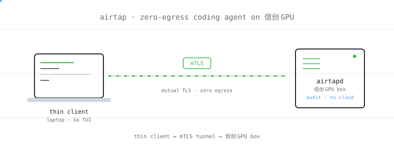
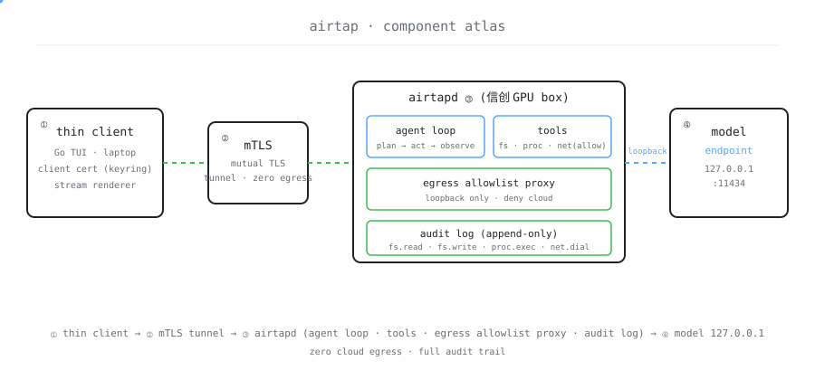

**English** | [简体中文](./README.md)

<picture>
  <source media="(prefers-color-scheme: dark)" srcset="./assets/hero-dark.svg">
  <source media="(prefers-color-scheme: light)" srcset="./assets/hero-light.svg">
  
</picture>

<p align="center"><sub>One command launches a coding agent on a 信创 intranet GPU box — zero cloud egress, zero SSH-tunnel juggling, every outbound call auditable. 信创 / state-enterprise dev under 数据不出境, finally as smooth as a cloud runner.</sub></p>

<p align="center">
  <a href="./LICENSE"></a>
  <a href="https://github.com/SuperMarioYL/airtap/releases"></a>
  <a href="https://github.com/SuperMarioYL/airtap/actions/workflows/ci.yml"></a>
  
</p>

> **Compress 6 steps of SSH + tmux + port-forwarding into one command, so 数据不出境 enterprise dev finally feels as smooth as a cloud runner.**

<h2> Architecture</h2>

<picture>
  <source media="(prefers-color-scheme: dark)" srcset="./assets/atlas-dark.svg">
  <source media="(prefers-color-scheme: light)" srcset="./assets/atlas-light.svg">
  
</picture>

Two processes, one binary each: `airtap` on the laptop and `airtapd` on the 信创 intranet GPU box. The client opens a single mTLS tunnel (tcp `:7437`) to the daemon; that same connection carries both the agent's tool-call stream and the TUI stream back. The agent runs **on-box** — `read` / `write` / `list` / `bash` tools operate on the box's repo directly, model calls stay on `127.0.0.1`, and the egress allowlist proxy is the only network egress the box has. Any dial not in `egress.allow` is denied and appended to `audit.log`. No SSH, no tmux, no port-forwarding, no cloud backend.

## Table of contents

- [Architecture](#architecture)
- [Why Airtap](#why-airtap)
- [Install](#install)
- [Quickstart](#quickstart)
- [Usage](#usage)
- [Demo](#demo)
- [Configuration](#configuration)
- [vs. cloud runners](#vs-cloud-runners)
- [Roadmap](#roadmap)
- [Pricing & licensing](#pricing--licensing)
- [License](#license)
- [Contributing](#contributing)

<h2> Why Airtap</h2>

信创 / state-enterprise devs need to run coding agents on intranet GPU boxes (Ascend 910C / 海光 DCU), because the Data Security Law and 等保 2.0 mandate that prompts and code context never leave the corporate intranet. The reality today: SSH into every box, hand-stitch port forwards so the laptop can reach the agent's HTTP surface, babysit tmux sessions, redo the whole dance on every reconnect — and compliance teams have no visibility into "what actually left the network." Airtap compresses SSH + tmux + tunnel + per-box config into one declarative `airtap.yaml` contract: the daemon refuses any outbound dial not in `egress.allow`, and every attempt (allowed or denied) is appended to `audit.log`. Cloud runners (Harness IDE / Reachpad) assume a cloud-reachable backend; 数据不出境 forbids that assumption by construction — so this isn't "hard to use," it's structurally unservable by cloud runners.

<h2> Install</h2>

```bash
# macOS (Homebrew)
brew install SuperMarioYL/tap/airtap

# Linux (direct binary)
curl -L https://github.com/SuperMarioYL/airtap/releases/latest/download/airtap-linux-amd64.tar.gz | tar xz
sudo mv airtap /usr/local/bin/

# or from source
go install github.com/SuperMarioYL/airtap/cmd/airtap@latest
```

Gitee mirror: `https://gitee.com/SuperMarioYL/airtap` (prefer this on CN networks). Requires Go 1.24+. `airtapd` runs on Linux 信创 boxes (Ascend / 海光); the laptop-side client supports Linux and macOS — Windows is out of scope for v0.1.

<h2> Quickstart</h2>

Three commands from cold clone to the first agent stream. `airtapd` is deployed once per box and reused forever after.

```bash
# 1. Initialize on the laptop (writes airtap.yaml + generates mTLS CA / client cert)
airtap init --box 10.0.0.5:7437

# 2. (one-time) Copy the daemon + CA to the GPU box and start it, listening on :7437 mTLS
scp airtapd ca.pem ops@gpu-box:/opt/airtap/ && ssh ops@gpu-box '/opt/airtap/airtapd &'

# 3. Connect → run the agent → read the egress audit
airtap connect
airtap run "add a /health endpoint to server.go"
airtap audit
```

<details><summary>Sample output</summary>

```
$ airtap connect
connected to 10.0.0.5:7437 (mTLS, ca=sha256:9f3a…) ✓

$ airtap run "add a /health endpoint to server.go"
▸ reading /opt/proj/server.go            (tool: read)
▸ calling model deepseek-v3 @ 127.0.0.1:8000   (egress: allow)
▸ writing /opt/proj/server.go            (tool: write)
✓ done — 1 file changed, +9 −0

$ airtap audit
2026-07-24T10:11:02  ALLOW  127.0.0.1:8000  deepseek-v3  model call
# the only outbound record for the whole run — zero other dials
```

</details>

<h2> Usage</h2>

The five most common workflows. Full examples in [`examples/`](./examples).

```bash
# Switch the on-box domestic model (DeepSeek-V3 / Qwen3-Coder / GLM-4.6, OpenAI-compatible endpoint)
airtap run --model qwen3-coder "make /health a readiness probe"

# Pin a workdir and a subset of tools
airtap run --workdir /opt/proj/svc-a --tools read,bash "run go test ./..."

# Connectivity self-check only, no agent
airtap connect --check

# Export the egress audit to your SIEM (append-only; OEM tier adds a hash chain)
airtap audit --since 24h --json > audit-24h.json

# Re-issue a client cert for a new box (after revoking the old one)
airtap init --box 10.0.0.6:7437 --rotate
```

`airtap run "<prompt>"` runs a minimal ReAct loop on-box: system prompt → call the on-box model → dispatch tools (`read` / `write` / `list` / `bash`) → loop until done. Only tool results and diffs cross the tunnel back to the TUI; the model dial always stays on `127.0.0.1`.

<h2> Demo</h2>


A 90-second demo: `airtap init` → `airtap connect` → `airtap run "add a /health endpoint to server.go"` → `airtap audit`. Recorded on a QEMU Ascend emulator (CPU mock model). `assets/demo.cast` is the asciinema source; `assets/demo.gif` is the rendered product, re-rendered on release by `docs/demo.tape` + `.github/workflows/demo.yml`.

<h2> Configuration</h2>

The core is the [`EgressManifest`](./examples/airtap.yaml) — a single `airtap.yaml` binds the four things usually strewn across SSH config, tmux scripts, and per-box env files into one contract:

| Key | Type | Default | Meaning |
| --- | --- | --- | --- |
| `box.addr` | string | required | GPU box address `host:port` |
| `box.tls` | string | `mTLS` | tunnel auth mode (v0.1: mTLS only) |
| `box.ca` | string | `./ca.pem` | CA cert path |
| `model.endpoint` | string | required | on-box model endpoint (OpenAI-compatible, `127.0.0.1`) |
| `model.name` | string | required | model name: `deepseek-v3` / `qwen3-coder` / `glm-4.6` |
| `egress.allow` | []string | required | allowlist of dial targets |
| `egress.mode` | string | `airgap` | `airgap` = deny every dial not in `allow` |
| `egress.audit` | string | `./audit.log` | audit log path (append-only) |
| `agent.workdir` | string | required | on-box working directory |
| `agent.tools` | []string | `[read,write,list,bash]` | enabled tools |

The daemon treats this manifest as a **contract**: any dial not in `egress.allow` is refused, and both allows and denies are written to `audit.log`. This isn't a config file — it's the airgap + audit primitive cloud runners structurally lack.

<h2> vs. cloud runners</h2>

| Capability | Airtap | Harness IDE / Reachpad | RelayBar |
| --- | :---: | :---: | :---: |
| 数据不出境 / airgap egress | ✓ | — | partial (forwards only, no intranet enforcement) |
| Outbound audit trail | ✓ | — | — |
| Agent lifecycle (start / run / stop) | ✓ | ✓ | — |
| 信创 domestic compute (Ascend / 海光) | ✓ | — | — |
| One-shot install / zero backend ops | partial (one `airtapd` copy) | ✓ (cloud-hosted) | ✓ |

Honest caveat: on "cloud-hosted, zero ops," Harness IDE / Reachpad are easier — their backend is cloud-managed, while Airtap places a daemon on the box. The trade buys airgap egress + audit + the 信创 surface, none of which a cloud runner's architecture can deliver.

<h2> Roadmap</h2>

**v0.1.0 (shipped)**

- [x] `airtap.yaml` parse + validate; `airtap init` emits mTLS CA / client cert
- [x] `airtapd` accepts mTLS on :7437; `airtap connect` prints connected
- [x] On-box ReAct agent loop + egress allowlist proxy + `airtap run` TUI stream
- [x] `airtap audit` renders the append-only trail; records `assets/demo.cast`

**Next**

- [ ] v0.2: agent-plugin spec (adapt Aider / Cline / Continue beyond the built-in minimal loop)
- [ ] v0.3: multi-box / fleet scheduling (one manifest → one box becomes one-to-many)
- [ ] Hash-chained `audit.log` (OEM tier, tamper-evident)
- [ ] GPU / NPU autodiscovery (endpoint is hand-configured today)
- [ ] Windows laptop client (v0.1 is Linux / macOS only)
- [ ] RBAC / multi-user / SSO (v0.1 is one dev per box)

<h2> Pricing & licensing</h2>

Airtap is a **commercial product**, licensed for private deployment. The binary is free for individual evaluation (clone it, run it, read the audit), but production / OEM use requires a license — this isn't "figured out later," it's a line item 数据不出境 buyers already carry.

**Private-deploy + OEM license unlocks three things:**

- **OEM branding** — swap the Airtap logo for the enterprise logo; integrators can re-brand it into their own domestic stack
- **Audit aggregation** — roll up multi-box `audit.log` into the enterprise SIEM for a unified egress view
- **Air-gap egress policy pack** — pre-built 等保三级 compliance allowlist templates, pass 等保 out of the box

**Pricing:**

- Pilot: ¥30,000 / first org / 12 months (pilot tier)
- Ongoing: ¥80,000 / org / year
- Paid via corporate bank transfer + VAT special invoice (standard state-enterprise procurement; credit card not supported)

**Hosted SaaS is structurally not offered** — 数据不出境 forbids any path that sends prompts / context to an offshore endpoint, including payment data. We use a self-hosted minimal license-server (Go, on-prem, offline activation file `.lic`); no Stripe.

**Smallest path to a signed deal:** design-partner interview → on their box, a live `airtap run "add a /health endpoint to server.go"` succeeds → generate an `airtap audit` report proving zero egress → the IT lead walks the audit report through internal procurement → ¥30k corporate transfer + invoice → mail the `.lic` + offline policy pack.

To run a pilot evaluation in your 信创 environment, start from [`examples/airtap.yaml`](./examples/airtap.yaml), or email `leo.stack@outlook.com`.

<h2> License</h2>

MIT — see [`LICENSE`](./LICENSE). Free for individual evaluation and OSS use; production / OEM deployment is covered under [Pricing & licensing](#pricing--licensing) above.

<h2> Contributing</h2>

Issues and PRs welcome. Open an issue first describing your scenario and reproduction path, then send the PR. Real-world friction reports from 信创 / domestic-compute boxes are especially valuable.

<p align=center><sub><a href=./LICENSE>MIT</a> © 2026 SuperMarioYL</sub></p>
