[简体中文](./README.md) · [Website](https://airtap.lei6393.com) · [GitHub](https://github.com/SuperMarioYL/airtap)

<picture>
  <source media="(max-width: 600px) and (prefers-color-scheme: dark)" srcset="./assets/presentation/hero-mobile-dark.svg">
  <source media="(max-width: 600px)" srcset="./assets/presentation/hero-mobile-light.svg">
  <source media="(prefers-color-scheme: dark)" srcset="./assets/presentation/hero-dark.svg">
  
</picture>

# airtap

**Keep remote agent work on your own box.**

Airtap connects a thin client to airtapd over mutual TLS. The daemon runs the model and tool loop against the work directory you configure.

v0.6.0 wires the plugin registry into the daemon and fixes loopback setup in the Aider network namespace. Running Aider still requires its environment and dependencies; the initialization example below does not launch an agent.

## Why use it

A remote development box needs a clear contract for its model endpoint, permitted tools and outbound destinations. A shared YAML manifest keeps these settings together and makes egress decisions inspectable.

- **One shared configuration** — Model, workdir, tools and egress are defined together.
- **Authenticated connection** — The client and daemon communicate over mTLS.
- **Inspect egress decisions** — The configured dialer records allowed and denied attempts.

## Architecture

<picture>
  <source media="(max-width: 600px) and (prefers-color-scheme: dark)" srcset="./assets/presentation/architecture-mobile-dark.svg">
  <source media="(max-width: 600px)" srcset="./assets/presentation/architecture-mobile-light.svg">
  <source media="(prefers-color-scheme: dark)" srcset="./assets/presentation/architecture-dark.svg">
  
</picture>

The client loads the manifest and opens the mTLS tunnel. airtapd dispatches the configured tools and sends model requests through the egress dialer. The dialer checks host:port membership and records allowed and denied attempts. Bash isolation uses Linux network namespaces.

| Component | Responsibility |
| --- | --- |
| `Thin client` | cmd/airtap |
| `mTLS tunnel` | internal/tunnel |
| `Agent loop` | internal/agent |
| `Egress + audit` | internal/egress; internal/audit |

## Install and quickstart

Build with the version declared in the repository manifest. Run the example from the repository root.

```bash
git clone https://github.com/SuperMarioYL/airtap.git
cd airtap
go build ./cmd/airtap
go build ./cmd/airtapd
```

The included example validates examples/airtap.yaml and compares a local model address with an unlisted address without dialing either.

```bash
go run ./examples/presentation-demo
```

## Recorded demo

<picture>
  <source media="(max-width: 600px) and (prefers-color-scheme: dark)" srcset="./assets/presentation/process-mobile-dark.svg">
  <source media="(max-width: 600px)" srcset="./assets/presentation/process-mobile-light.svg">
  <source media="(prefers-color-scheme: dark)" srcset="./assets/presentation/process-dark.svg">
  
</picture>

The local model address is allowed; example.com:443 is not.

```text
manifest: valid; model=deepseek-v3; tools=[read write list bash]
127.0.0.1:8000 allowed=true
example.com:443 allowed=false
```

The complete command and output are recorded in [docs/demo-results.json](./docs/demo-results.json). Inputs and reproduction code are included in the repository.

## Usage

The CLI exposes the following operations. Commands after the example use your own paths or identifiers.

```bash
mkdir -p local-config
go run ./cmd/airtap init --out ./local-config
go run ./cmd/airtap run --manifest ./airtap.yaml "Inspect this repository"
go run ./cmd/airtap audit --file ./audit.log
```

## Configuration

Create the output directory before init. Distribute the manifest and TLS material to the two endpoints, protect ca.key, and set box.addr, model.endpoint, egress.allow and agent.workdir for the actual deployment. agent.max_iterations accepts 0 for the default limit.

## Integrations and responsibilities

<picture>
  <source media="(max-width: 600px) and (prefers-color-scheme: dark)" srcset="./assets/presentation/integrations-mobile-dark.svg">
  <source media="(max-width: 600px)" srcset="./assets/presentation/integrations-mobile-light.svg">
  <source media="(prefers-color-scheme: dark)" srcset="./assets/presentation/integrations-dark.svg">
  
</picture>

The following routes are implemented in the source. Choose the input that matches your task and keep the resulting artifact with your project.

| Route | Implemented role |
| --- | --- |
| YAML | Model, tools and box settings |
| mTLS | Client / daemon stream |
| OpenAI-compatible HTTP | Configured model endpoint |
| Audit log | Outbound dial decisions |

## Limits and next steps

- The offline demo checks configuration and policy membership only. It does not start a daemon, call a model, or validate Linux isolation.
- Bash execution requires Linux network namespace support and suitable privileges; it fails closed when isolation cannot be created.
- The dialer governs traffic routed through it; this is not a compliance certification or a firewall for unrelated processes.

Further work includes deployment validation on target boxes and broader agent adapters. These require their own integration testing.

## License and contributions

See [LICENSE](./LICENSE). When reporting an issue, include a minimal input, the command, and the observed output.
